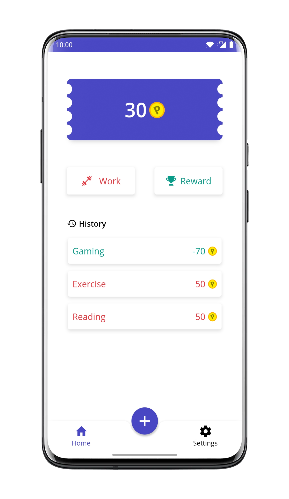

# Pointify
Pointify helps assign meaning and value to each task you perform.
By converting Work to Points earned and leisure activities to Rewards which can be spent, the user is able to manage and make the most out of their lives.
Its like a Wallet, but for your life.

- A Clean and Minimal Interface
- Allows Users to easily add Work or Reward Activities, and allowing them to repeat it at will
- Follows System Dark Theme on devices which support it

Download: https://play.google.com/store/apps/details?id=com.rr.pointify

 

 

